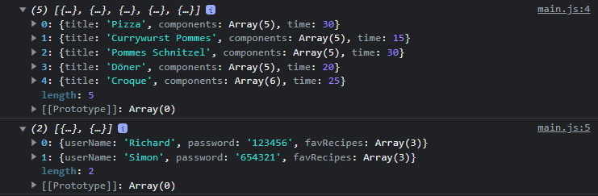
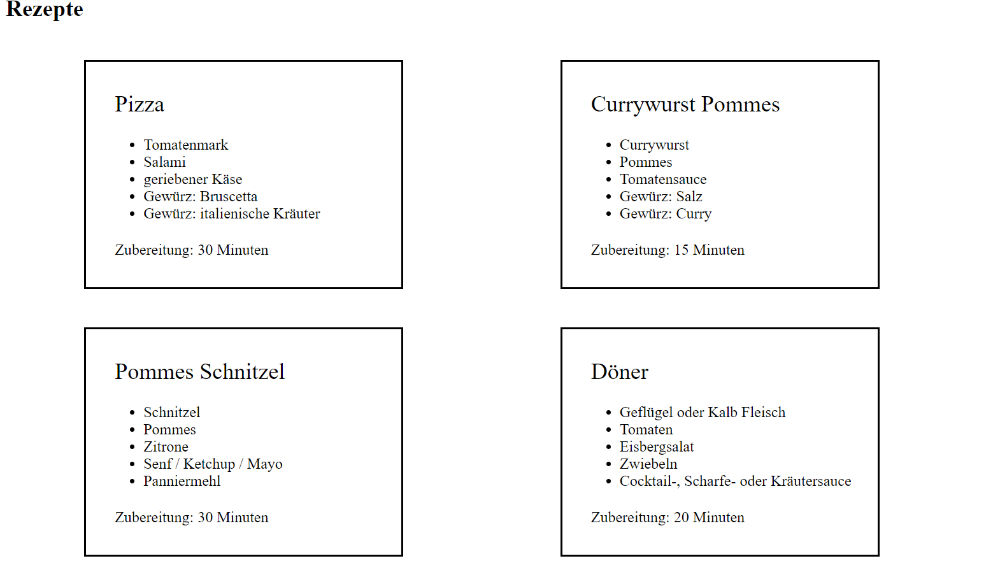

# DOM Exercise - Rezeptseite II

Die README.md in der Preview anzusehen bietet große Vorteile! ^^

Im HTML & CSS Modul hast du eine Rezeptseite aufgebaut, du kannst diese verwenden oder zur Übung eine neue Rezeptseite aufbauen. In diesem Projekt geht es zwar nicht in erster Linie um das Styling, dennoch kann eine kleine Auffrischung nicht schaden. Das Ziel dieser Aufgabe ist eine Rezeptseite aufzubauen, die mit dynamischen Daten gefüllt ist und auf Userinteraktionen reagiert.

## Vorbereitungen

- lese die Aufgaben vorab durch
- Plane dein Vorgehen (was wird ungefähr an Techniken benötigt?)
- Lege einen Branch mit deinem Namen an, pushe regelmäßig und erzeuge einen Pull Request, falls ich zwischen durch mal rein schauen soll
- Daten sollten Ausgelagert werden (ES6 Modules: import/export)
-

## Aufgaben

| Beschreibung                                                                                 | Schwierigkeitsgrad |
| -------------------------------------------------------------------------------------------- | ------------------ |
| Suche dir 5-10 Rezepte raus                                                                  | leicht             |
| Lege die rezeptDaten als Array of Objekts an                                                 | leicht             |
| importiere die Rezepte in deine JS-Datei                                                     | leicht             |
| Gib alle Rezepte in Rezeptkarten aus (siehe Bild)                                            | schwer             |
| Lege 2-3 User an mit userName, password und 1-3 Lieblingsrezepte                             | leicht             |
| Baue ein Login Formular (HTML)                                                               | mittel             |
| Werte die Login-Daten (userName und password) aus                                            | mittel             |
| Wenn der User sich eingeloggt hat, gebe seinen userName aus                                  | mittel             |
| Erzeuge einen Logout Button, der nur zu sehen ist, wenn der User eingelogt ist               | mittel             |
| Klickt der User auf Logout, lösche die gespeicherten userDaten und zeige erneut den Login an | mittel             |
| Ist der user eingeloggt sollten nur noch seine Lieblingsrezepte angezeigt werden             | schwer             |

### Output der importierten Daten

Denke an: type="module", export, import ... .js

### Output der Rezepte

### Notizen:

### Planung

### Feedback
